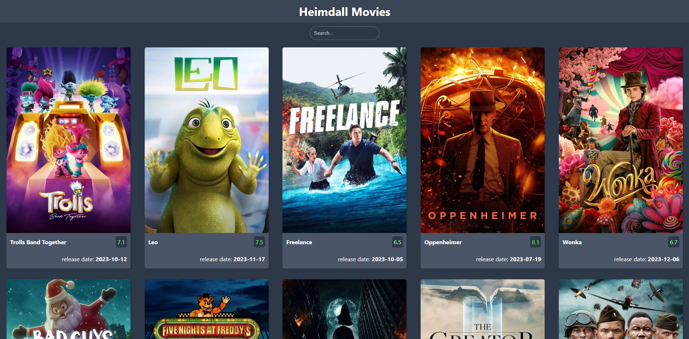

# Movie List App Coding Task

## Introduction

Welcome to the Heimdall Powers Movie List App coding task! This task is designed to assess your skills in building a front-end application using React and TypeScript. The goal is to create a movie list application that fetches data from the TMDB API and allows users to search for movies, view a list of popular movies, and see detailed information about each movie.

This repository includes code fetching and displaying popular movies without any styling. You can use this as a starting point or create your own project using Create React App or any other preferred method.

## Exercise

### Exercise 1: Styling and responsive layout

Add styling to the popular movie list. You do not need to focus too much on pretty design but the styling should be functional and responsive.
You can try to recreate the style below or make your own.

### Exercise 2: Search and Filter

Add a search bar that allows users to search for movies by title. Also, provide options to filter movies by release year or any other relevant criteria.

### Exercise 3: Loading and Error Handling

Implement loading indicators while fetching data and handle errors gracefully by displaying an error message when the API request fails.

### Exercise 4: Bonus (Optional)

Implement additional features such as pagination for the movie list, sorting options, search as you type, or a "favorites" functionality where users can add movies to their favorites list.

## Submitting Your Solution

When you're ready to submit your solution, follow these steps:

1. Commit your changes to your forked repository.
2. Send us a link to that repository
   or
3. zip your solution
4. send the zip attached in a mail

Feel free to use any additional libraries or tools you find appropriate.

Good luck, and happy coding!
